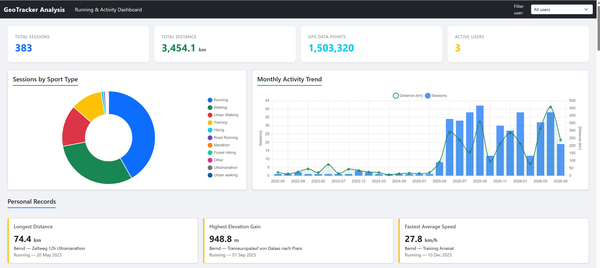
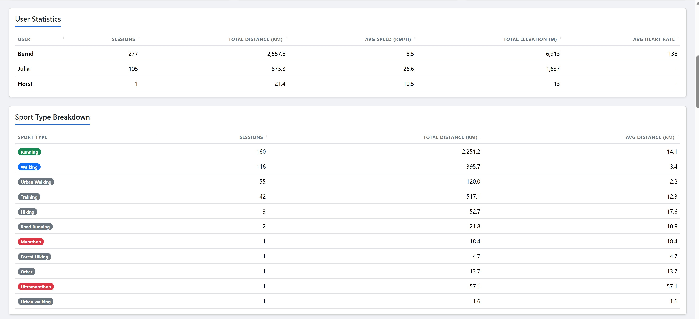
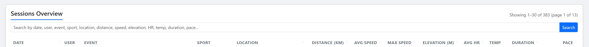
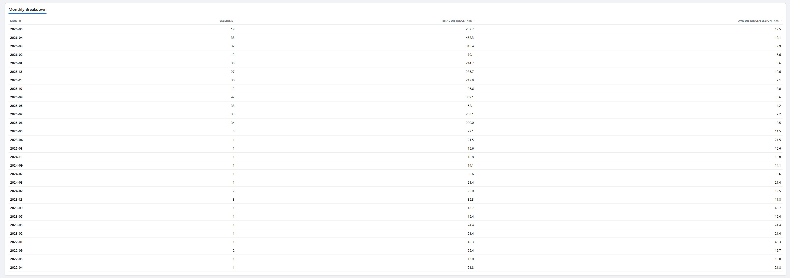
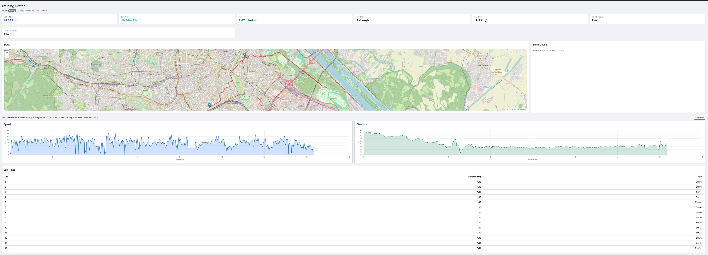

# GeoTracker Analyse

Analysis dashboard for GPS tracking data collected by the GeoTracker app.
Renders aggregate stats, per-session detail with map and synced charts, and
deploys as a WAR to an external Tomcat.

## What you can analyse

### Across all sessions (Dashboard)

- **Summary KPIs** — total sessions, total distance (km), total GPS data
  points, active users.
- **Sport-type breakdown** — doughnut chart and table: sessions, total
  distance, average distance per sport (Running, Walking, Cycling,
  Marathon, Ultramarathon, …).
- **Monthly activity trend** — combined bar/line chart of sessions per
  month vs. distance per month, plus a sortable Monthly Breakdown table.
- **Per-user stats** — sessions, total distance, average speed, total
  elevation gain, average heart rate per user (with an "All users / single
  user" filter in the navbar that scopes the whole dashboard).
- **Personal records** — fastest pace, longest distance, highest elevation
  gain, etc., as highlighted cards.
- **Fastest paces (Running)** — leaderboard of the quickest paces with
  user, event, date, distance and duration.
- **Sessions Overview** — paginated, sortable table of every session with
  date, user, event, sport, location, distance, avg/max speed, elevation,
  avg HR, temperature, duration and pace. Includes a free-text search box
  that matches across all of those fields at once.
- **Upcoming / planned events** — events scheduled for the future, with
  completion status and optional website link.

### Per session (Session detail)

- **Summary cards** — distance, duration, pace, avg speed, max speed,
  elevation gain, plus heart-rate (avg/min/max) and average temperature
  when available.
- **GPS track on a Leaflet map** — the full route rendered from
  `gps_tracking_points`. Hovering any chart drops a marker on the matching
  GPS point and re-centres the map.
- **Point Details side panel** — for the hovered point: time, speed,
  elevation, HR, slope, temperature, humidity, wind (km/h + cardinal),
  weather (text + WMO code), pressure, sea-level pressure, barometric
  altitude, GPS accuracy, satellite count.
- **Synced charts** — Speed, Elevation, Heart Rate, and Heart Rate vs
  Altitude (scatter). All share a numeric distance axis; wheel/pinch zoom,
  drag-to-pan and shift-drag box-zoom stay in sync across charts. A "Reset
  zoom" button restores the full range.
- **Lap times** — distance and pace per lap when `lap_times` data is
  present.

## Screenshots

### Dashboard

KPI summary, sport-type doughnut, monthly activity trend and personal-records cards:



Per-user statistics and sport-type breakdown:



Sessions Overview with free-text search across every column:



Fastest paces leaderboard and upcoming planned events, side by side:


Monthly breakdown — sessions, total distance, average distance per session:



### Session detail

GPS track on a Leaflet map, summary cards, synced Speed/Elevation charts and per-lap times:



## How metrics are computed

All speed, pace and duration figures are derived from the GPS points
themselves, **not** from the `average_speed` / `max_speed` columns the
tracker writes per point. Those columns are running values from the
device and can spike during a session, so trusting them produces things
like a 20 km/h "average" on an 8 km/h run.

The conventions across every query are:

| Metric                     | Computed as                                                          |
| -------------------------- | -------------------------------------------------------------------- |
| **Duration**               | `MAX(event timestamp) - MIN(event timestamp)` per session             |
| **Distance**               | `MAX(distance)` per session (cumulative column)                       |
| **Average speed (session)**| `distance / duration × 3.6` (km/h); reported as 0 when duration < 1s |
| **Max speed**              | `MAX(max_speed)` from the GPS points                                  |
| **Pace**                   | `(duration ÷ 60) ÷ distance_km`, formatted as `m:ss min/km`           |
| **Average speed (user)**   | `SUM(distance) / SUM(duration) × 3.6`, restricted to sessions with duration ≥ 60s |
| **Fastest avg-speed record** | Same as session avg speed, restricted to distance > 1 km and duration ≥ 60s |

The 60-second floor on aggregated and record queries filters out
sessions where every GPS point shares essentially the same timestamp
(e.g. bulk-imported historical data) — those would otherwise divide a
real distance by a near-zero duration and contaminate the result with
absurd speeds.

The event timestamp is `received_at`, which preserves the original time
when historical sessions are uploaded. `created_at` is used only as a
fallback for older rows that do not have a received timestamp.

## Stack

- Java 26, Spring Boot 4.0.5 (WebMVC, Data JPA, Thymeleaf)
- PostgreSQL (native queries against `gps_tracking_points`,
  `tracking_sessions`, `users`, `lap_times`)
- Bootstrap 5, Leaflet 1.9, Chart.js 4, Hammer.js 2, chartjs-plugin-zoom 2
- Gradle, packaged as `analyse.war` for external Tomcat
  (`bootWar` is disabled)

## Configuration

Database connection is read from environment variables; nothing sensitive
lives in the repo.

| Variable      | Default                                            |
| ------------- | -------------------------------------------------- |
| `DB_URL`      | `jdbc:postgresql://localhost:5432/geotracker`      |
| `DB_USER`     | `geotracker`                                       |
| `DB_PASSWORD` | *(required, no default)*                           |

The app expects a pre-existing schema; `spring.jpa.hibernate.ddl-auto=none`.

## Run locally

```sh
# Windows (PowerShell)
$env:DB_PASSWORD = "..."
./gradlew bootRun

# Linux/macOS
DB_PASSWORD=... ./gradlew bootRun
```

Then open http://localhost:8080/.

## Build the WAR

```sh
./gradlew clean war
# -> build/libs/analyse.war
```

## Deploy to Tomcat

1. Copy `build/libs/analyse.war` into Tomcat's `webapps/` directory.
2. Set `DB_URL`, `DB_USER`, `DB_PASSWORD` in Tomcat's environment
   (`setenv.sh` / `setenv.bat`, or `JAVA_OPTS=-D...`).
3. The app is reachable at `http://<tomcat-host>:<port>/analyse/`.

`ServletInitializer` extends `SpringBootServletInitializer`, so the WAR
boots correctly under an external servlet container.

## Project layout

```
src/main/java/at/co/netconsulting/analyse/
  AnalyseApplication.java      # Spring Boot entry point
  ServletInitializer.java      # WAR bootstrap for Tomcat
  controller/                  # AnalysisController (HTML + /api/session/{id}/track)
  service/AnalysisService.java # aggregation & DTO mapping
  repository/                  # JPA repos with native queries
  entity/                      # JPA entities mapping the GeoTracker schema
  dto/                         # view-model records (TrackPoint, SessionDetail, ...)
src/main/resources/
  templates/                   # Thymeleaf views (dashboard, session-detail)
  application.properties       # env-var-driven datasource config
docs/screenshots/              # README images
```

## API

| Path                          | Returns                                |
| ----------------------------- | -------------------------------------- |
| `GET /`                       | Dashboard (HTML)                       |
| `GET /session/{sessionId}`    | Session detail page (HTML)             |
| `GET /api/session/{id}/track` | Track points as JSON `TrackPoint[]`    |
